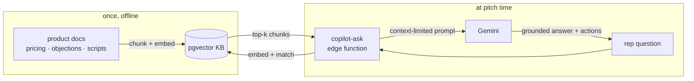
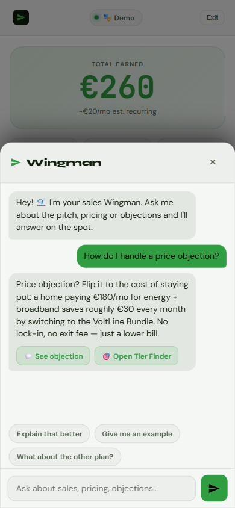
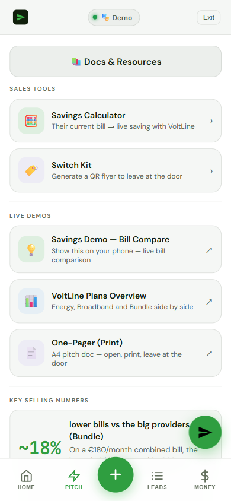

# PitchPilot — a field-sales companion with a RAG copilot (case study)

**A RAG copilot that turns a 40-page sales playbook into a grounded, cited, one-paragraph answer — at the doorstep, in real time.**

> Source is private. This is the architecture and the thinking behind it — no product
> code. The retrieval technique is shown, runnable, in a separate repo:
> **[rag-demo](https://github.com/augbastos/rag-demo)**.

**PitchPilot** is a white-label app for door-to-door / field sales reps: capture a
lead, run the pitch, handle objections, and track commission — all on a phone, at the
door. Its core is **Wingman**, a retrieval-augmented copilot that answers a rep's
question ("what do I say when they mention price?") from the product's own knowledge
base, in real time, grounded and cited.

**Where it stands:** this is a live, working demo — branded **"VoltLine"** for a
fictional energy-sector vertical — not yet deployed to a real sales team. Everything
below (the architecture, the debugging, the fixes) is real and running in that demo
today; the next milestone is a first paying field-sales client.

## The problem

A field rep can't read a 40-page playbook on a doorstep. When a prospect pushes back,
the rep has seconds to answer, accurately, in the product's own words. Wingman turns
the whole playbook — pricing, objections, scripts — into something you ask in natural
language and get a one-paragraph, on-message answer from.

## Architecture

- **Knowledge base** — the playbook is chunked, embedded, and stored in **Supabase pgvector**, partitioned by product so a white-label tenant only ever retrieves its own content.
- **Retrieval RPC** — a Postgres `match` function returns the nearest chunks; this is the exact shape shown in [rag-demo](https://github.com/augbastos/rag-demo).
- **Grounded generation** — a **Supabase Edge Function** builds a context-limited prompt and calls **Gemini**. The system prompt hard-limits the model to the retrieved chunks and forbids inventing pricing or promises — accuracy over hype, because a wrong answer at a doorstep costs a sale.
- **White-label** — one codebase rebrands for any industry in under a day; a public demo runs as "VoltLine", a fictional energy-sector tenant, not a client.

## What made it actually work (the debugging that mattered)

- **Retrieval was silently returning nothing.** An IVFFlat index over a tiny corpus collapsed recall to zero — the copilot kept deflecting to "check the FAQ." Dropping to exact search fixed it instantly. Lesson: approximate indexes need enough rows to be approximate *over*.
- **Truncated mid-sentence answers.** The model is a "thinking" variant; reasoning tokens were eating the output budget. Setting the thinking budget to zero restored full answers.
- **Cost under load.** The free tier dried up during a 50-question QA run, so generation falls back through a cost-ordered chain of models to stay within quota.

## What a competitive check found and fixed

A 2026-07-04 pass benchmarked PitchPilot's positioning against established
sales-enablement categories — Gong/Chorus (conversation intelligence), Klue/Crayon
(competitive intel), Highspot/Seismic (enablement platforms). The "rebrand any
industry in under a day" claim held up for **speed**: new content, new brand, no code
change. It did not hold up for **concurrency**. The knowledge base used a hardcoded
two-value product set (`luckycat` and a single `template` slot), and the indexer
deleted-and-reinserted that one `template` slot on every rebrand — so reindexing a
second industry vertical silently wiped out whatever demo was already using it. Two
white-label demos could never run at the same time; the claim was only ever true one
vertical at a time.

Fix: replaced the hardcoded slot with a real multi-tenant KB registry (migration
`0096_pitcher_kb_tenants`) — each vertical now gets its own registered slug, its own
isolated chunks, and a foreign-key constraint that stops any unregistered slug from
writing content at all. Multiple industry demos can now coexist without one erasing
another.

## Isolating the demo (a security note)

The public demo and the real product shared one API key, so demo traffic burned the
production quota. I added product-aware key selection in the edge function — the demo
tenant uses its own key — so a curious visitor can never exhaust or bill the real one.

## Screenshots

> Screenshots are from the public white-label demo (fictional "VoltLine" energy tenant), not a client deployment.

| Wingman — answering a live price objection | Pitch kit — tools, demos & key numbers |
|---|---|
|  |  |

## Stack

`Supabase (pgvector · Edge Functions)` · `Gemini` · `RAG` · `TypeScript / React` · `Cloudflare Pages`

## Live demo & the technique

- Live demo: https://lucky-cat.pages.dev/pitcher-template/
- The retrieval pipeline, runnable end-to-end: **[github.com/augbastos/rag-demo](https://github.com/augbastos/rag-demo)**

More work: [augustobastos.pages.dev](https://augustobastos.pages.dev)
