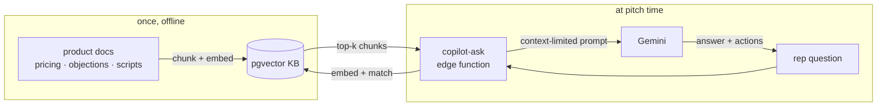
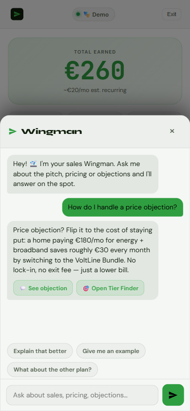
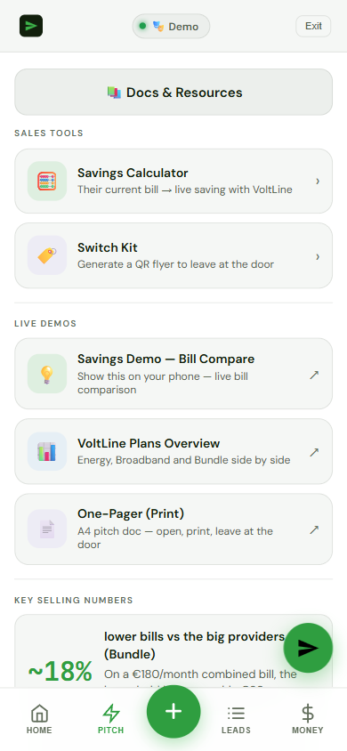

# PitchPilot — a field-sales companion with a RAG copilot (case study)

**A RAG copilot for field sales reps: ask a question about the playbook, get a one-paragraph answer and a button to the source doc — at the doorstep.**

> Source is private. This is the architecture and the thinking behind it — no product
> code. The retrieval technique is shown, runnable, in a separate repo:
> **[rag-demo](https://github.com/augbastos/rag-demo)**.

**PitchPilot** is a white-label app for door-to-door / field sales reps: capture a
lead, run the pitch, handle objections, and track commission — all on a phone, at the
door. Its core is **Wingman**, a retrieval-augmented copilot that answers a rep's
question ("what do I say when they mention price?") from the product's own knowledge
base. The system prompt instructs the model to answer using only
the retrieved chunks, and the app can hand the rep a button straight to the source doc. The
prose itself is deliberately clean of inline citations: a rep reading off a doorstep does
not want `[chunk 3]` in the middle of a sentence.

**Where it stands:** this is a working demo — branded **"VoltLine"** for a
fictional energy-sector vertical — not yet deployed to a real sales team. Everything
below (the architecture, the debugging, the fixes) is real and runs in that demo.
It has no users and no client.

## The problem

A field rep can't read a whole playbook on a doorstep. When a prospect pushes back,
the rep has seconds to answer, accurately, in the product's own words. Wingman turns
the whole playbook — pricing, objections, scripts — into something you ask in natural
language and get a one-paragraph, on-message answer from.

## Architecture

```mermaid
flowchart LR
    subgraph Ingest [once, offline]
        D[product docs<br/>pricing · objections · scripts] -->|chunk + embed| KB[(pgvector KB)]
    end

    subgraph Ask [at pitch time]
        R[rep question] --> EF[copilot-ask<br/>edge function]
        EF -->|embed + match| KB
        KB -->|top-k chunks| EF
        EF -->|context-limited prompt| G[Gemini]
        G -->|answer + actions| R
    end
```

- **Knowledge base** — the playbook is chunked, embedded, and stored in **Supabase pgvector**, partitioned by product to group each vertical's content.
- **Retrieval RPC** — a Postgres `match` function returns the nearest chunks; this is the exact shape shown in [rag-demo](https://github.com/augbastos/rag-demo).
- **Generation with retrieved context** — a **Supabase Edge Function** builds a prompt from the retrieved chunks and calls **Gemini**. The system prompt instructs the model to use only those chunks and not invent pricing or promises. These instructions guide generation; they do not guarantee factual accuracy.
- **White-label** — one codebase can be rebranded for another industry by swapping content and brand; the demo runs as "VoltLine", a fictional energy-sector tenant, not a client.

## What made it actually work (the debugging that mattered)

- **Retrieval was silently returning nothing.** An IVFFlat index over a tiny corpus collapsed recall to zero — the copilot kept deflecting to "check the FAQ." Dropping to exact search fixed it instantly. Lesson: approximate indexes need enough rows to be approximate *over*.
- **Truncated mid-sentence answers.** The model is a "thinking" variant; reasoning tokens were eating the output budget. Setting the thinking budget to zero restored full answers.
- **Cost under load.** The free tier dried up during a 50-question QA run, so generation falls back through a cost-ordered chain of models when quota is exhausted.

## What a competitive check found and fixed

A 2026-07-04 pass benchmarked PitchPilot's positioning against established
sales-enablement categories — Gong/Chorus (conversation intelligence), Klue/Crayon
(competitive intel), Highspot/Seismic (enablement platforms). The "rebrand any
industry" claim held up on **effort** in the one rebrand I tried: new content, new brand, no code
change. It did not hold up for **concurrency**. The knowledge base used a hardcoded
two-value product set (`luckycat` and a single `template` slot), and the indexer
deleted-and-reinserted that one `template` slot on every rebrand — so reindexing a
second industry vertical silently wiped out whatever demo was already using it. Two
white-label demos could never run at the same time; the claim was only ever true one
vertical at a time.

Fix: replaced the hardcoded slot with a real multi-tenant KB registry (migration
`0096_pitcher_kb_tenants`) — each vertical now gets its own registered slug and
chunks, with a foreign-key constraint requiring chunks to reference a registered
slug. Multiple industry demos can now coexist without one erasing another.

## Isolating the demo (a security note)

The public demo and the real product shared one API key, so demo traffic burned the
production quota. I added product-aware key selection in the edge function, so the
demo tenant now runs on its own key instead of the production one.

## Screenshots

> Screenshots are from the public white-label demo (fictional "VoltLine" energy tenant), not a client deployment.

| Wingman — answering a price objection | Pitch kit — tools, demos & key numbers |
|---|---|
|  |  |

## Stack

`Supabase (pgvector · Edge Functions)` · `Gemini` · `RAG` · `TypeScript (Edge Functions)` · `Cloudflare Pages`

## The technique

- The retrieval pipeline, runnable end-to-end: **[github.com/augbastos/rag-demo](https://github.com/augbastos/rag-demo)**

More work: [augustobastos.pages.dev](https://augustobastos.pages.dev)
